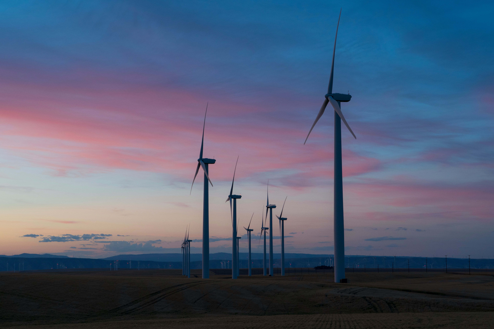

# Analyzing the Relationship between Renewable Energy Adoption,CO2 Emissions, and Economic Growth in Germany, Sweden, and Bulgaria (2000–2021)

> *This repository has been forked from the [jvalue-made-template](https://github.com/jvalue/made-template) repository.*

<figure>
    
</figure>

## Project Overview
The study aims to clarify the impact of changes in GDP and the adoption of renewable energy sources on electricity demand patterns and carbon emissions in Germany, Sweden, and Bulgaria from 2000 to 2021.

In order to provide a comprehensive understanding, Germany, Sweden, and Bulgaria were selected to represent a different spectrum of economic development and renewable energy policies. The results of this analysis will offer valuable insights into the effectiveness of sustainable economic growth on reducing electricity demand and CO2 emissions.

# Data Sources
| | Data source 1 | Data source 2 |
| ----------- | ----- | ----------- |
| Title | European Electricity | World GDP |
| Metadata URL | [European Electricity 2022](https://ember-climate.org/insights/research/european-electricity-review-2022/#supporting-material) | [World Bank GDP Metadata](https://databank.worldbank.org/reports.aspx?source=2&type=metadata&series=NY.GDP.MKTP.CD) |
| Data URL | [European Electricity Raw Data](https://ember-climate.org/app/uploads/2022/02/EER_2022_raw_data.zip) | [World Bank GDP Data](https://api.worldbank.org/v2/en/indicator/NY.GDP.MKTP.CD?downloadformat=csv) |
| Data Type | CSV Directory | CSV |
| License | CC-BY-4.0 [License](https://ember-climate.org/creative-commons/) | CC-BY-4.0 [License](https://datacatalog.worldbank.org/public-licenses#cc-by) |
| Description | The European Electricity Dataset from Ember provides a collection of datasets related to electricity generation, CO2 emissions, net import and demand across various countries in Europe. For this project, we will remove the net import dataset and focus on the other variables (generation, CO2 emissions and demand) to analyze the adoption of renewable energy sources for Germany, Sweden, and Bulgaria from 2000 to 2021. | This dataset provides annual GDP figures in US dollars for countries worldwide from 1960 to 2021. For this project, we will focus the GDP data for Germany, Sweden, and Bulgaria from 2000 to 2021. |

## Steps to run pipeline

This pipeline will run the programmed ETL and save the required data sources for the analysis/study in `\data``\data` directory. There should be 4 datasets ***demand.csv, emission.csv, generation.csv, and world_gdp.csv***

- [ ] Clone the project using SSH
```
  git clone git@github.com:Jovinjo/made-rep.git
```

- [ ] Go to the main directory
```
  cd made-rep
```

- [ ] Run the Pipeline bash script
```
  bash project/pipeline.sh
```

## Test environment

Test environment also provided to ensure that the ETL functions properly.

```
  bash project/tests.sh
```

A Github Action has been created at [CI](https://github.com/Jovinjo/made-rep/blob/main/.github/workflows/system-test-feedback.yml) .This allows to execute the test on every push to the main branch.

## Further Links

- Link to the Jupyter Notebook: [analysis-report.ipynb](https://github.com/Jovinjo/made-rep/blob/main/project/analysis-report.ipynb)
- Link to the Final Report: [analysis-report.pdf](https://github.com/Jovinjo/made-rep/blob/main/project/analysis-report.pdf)
- Link to the Data Quality Report: [data-report.pdf](https://github.com/Jovinjo/made-rep/blob/main/project/data-report.pdf)

HAVE FUN! :smile:

# Exercise Badges
     